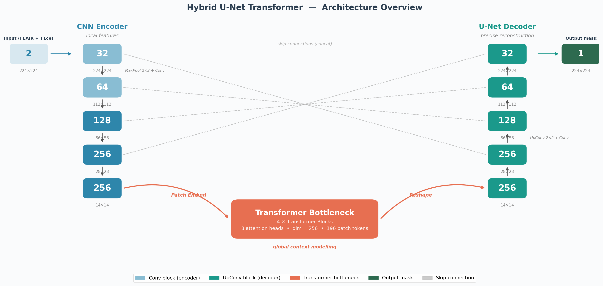

# Brain Tumor Segmentation Using Hybrid CNN-Transformer Architecture

**Author:** Musabek Musaev

This repository contains the implementation of a **Hybrid U-Net Transformer** for 2D brain tumor segmentation on MRI scans. The model combines the local feature extraction strength of a standard U-Net (CNN) with the global context modeling capability of a Vision Transformer bottleneck.

The project was evaluated on the **BraTS 2020** dataset and achieves state-of-the-art competitive performance while being lightweight enough to train on a single consumer-grade GPU (e.g., NVIDIA RTX 4060 8GB).

---

## Performance Comparison (BraTS 2020 Validation Set)

Evaluated on 1,176 validation slices from 74 held-out patients:

| Model | Mean Dice ↑ | Mean IoU ↑ | Mean Hausdorff Distance (px) ↓ |
|---|---|---|---|
| Baseline U-Net | 0.8339 | 0.7512 | 14.984 |
| **Hybrid U-Net Transformer** | **0.8409** | **0.7577** | **14.266** |

*See the `results/` folder and `paper_figures/` for detailed metrics, visualizations, and ablation studies.*

---

## Architecture Overview

The Hybrid U-Net Transformer replaces the standard CNN bottleneck with a 4-block Transformer module (dim=256, 8 attention heads). This allows the model to process 196 patch tokens representing the $14 \times 14$ spatial grid, enabling global context reasoning which is crucial for large or irregularly shaped tumors.



---

## Project Structure

```
brain_tumor_segmentation/
├── src/
│   ├── config.py           # Hyperparameters and paths
│   ├── preprocess.py       # 3D NIfTI to 2D slice conversion
│   ├── dataset.py          # PyTorch Dataset
│   ├── transforms.py       # Data augmentation (Albumentations)
│   ├── losses.py           # Dice + Focal compound loss
│   ├── metrics.py          # Dice, IoU, Hausdorff evaluation
│   ├── train.py            # Training loop with AMP and Deep Supervision
│   ├── evaluate.py         # Evaluation and mask generation
│   ├── report.py           # Comparison metrics extraction
│   └── models/
│       ├── unet.py         # Standard U-Net baseline
│       └── hybrid_unet.py  # Proposed Hybrid U-Net Transformer
├── paper_figures/          # High-quality figures generated for the paper
├── scripts/                # Scripts to generate figures
├── results/                # Quantitative and qualitative results
├── report.pdf              # Full research report paper
├── REPORT_PAPER.md         # Markdown version of the report
└── requirements.txt        # Python dependencies
```

---

## Setup & Training

### 1. Requirements
- Python 3.10+
- PyTorch with CUDA support
```bash
pip install -r requirements.txt
```

### 2. Dataset Preparation
1. Download the BraTS 2020 dataset and place it in `data/raw/MICCAI_BraTS2020_TrainingData/`.
2. Run preprocessing to convert 3D volumes to 2D slices:
```bash
python -m src.preprocess
```

### 3. Training
Train the baseline U-Net:
```bash
python -m src.train --model unet --epochs 50
```

Train the Hybrid U-Net Transformer:
```bash
python -m src.train --model hybrid --epochs 50
```

### 4. Evaluation
```bash
python -m src.evaluate --checkpoint checkpoints/hybrid_best.pth --model hybrid
```
